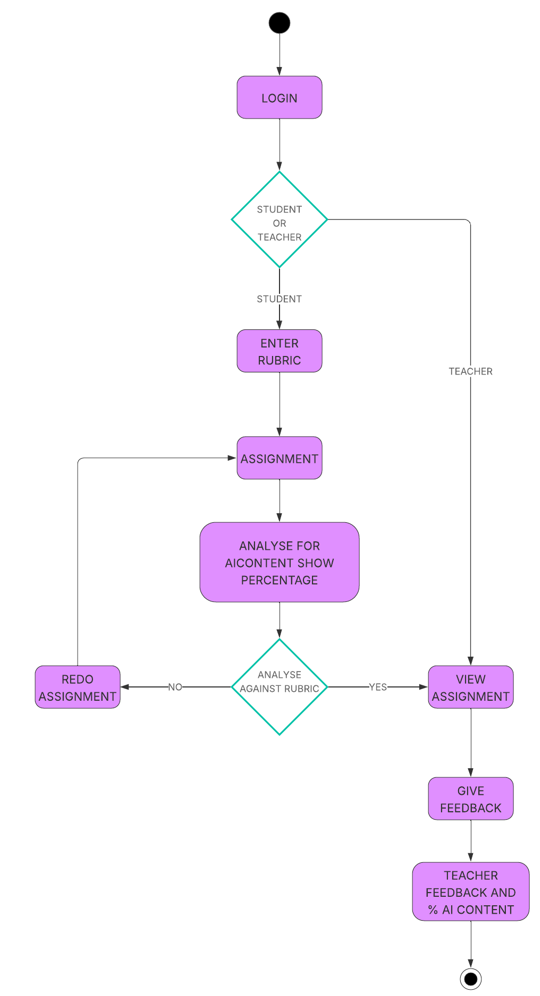
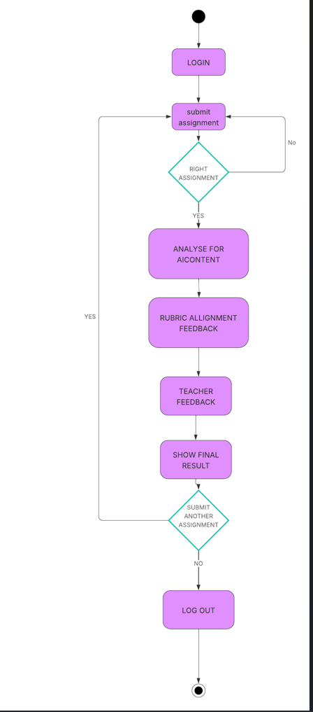

**Diagram 1**

1. **Start → Login**
    - Authenticate and assign **role** (Student or Teacher).
2. **Decision: Student or Teacher**
    - **Teacher path (right branch):** Lands on a **View Assignment** queue (pending items that already passed alignment), then proceeds to feedback (steps 6–8 below).
    - **Student path (downward branch):** Continues to student tasks.
3. **Enter Rubric (Student)**
    - Student **selects or inputs** the marking rubric (or chooses a teacher-published template).
    - Validation: rubric present, criteria weights sum to 100, thresholds set.
4. **Assignment (Student)**
    - Student uploads the assignment (file/text) and any metadata (course, unit, due date).
    - Validation: file type/size, plagiarism/duplicate submission checks, course mapping.
5. **Analyse for AI Content – show percentage (System)**
    - System produces an **AI-generated content percentage** (e.g., 12%).
    - Store raw scores + model version for auditability.
6. **Decision: Analyse Against Rubric (Pass?)**
    - The system scores against the rubric (criteria-by-criteria).
    - **If NO (fails threshold):** student is routed to **Redo Assignment** → back to **Assignment** to resubmit. The AI% and rubric gaps can be shown to guide revision.
    - **If YES (meets threshold):** the item is **released to the teacher** queue.
7. **View Assignment (Teacher)**
    - Teacher sees submissions that **already meet** minimum rubric alignment.
    - Includes the system’s rubric score breakdown and AI% for context.
8. **Give Feedback (Teacher)**
    - Teacher adds qualitative comments and (optionally) criterion-level adjustments or overrides.
9. **Final Output**
    - System compiles **Teacher Feedback + % AI Content** (and usually the rubric score/heat-map) and publishes to the student.
    - **End.**

**When this flow is ideal**

- You want to **reduce teacher load** by filtering out clearly misaligned drafts.
- You allow **student-defined rubrics** (or choosing from templates) and want a gate before review.
- You need a **strict pass-to-review** pipeline.

**Diagram 2**

1. **Start → Login**
    - Authenticate user (role is still known, but the visual flow focuses on the student lane).
2. **Submit Assignment (Student)**
    - Upload file or paste text; attach course/assignment ID.
3. **Decision: Right Assignment?**
    - Quick **sanity/validation** gate (correct course, file type, required fields).
    - **If No:** loop back to **Submit Assignment** (fix issues).
4. **Analyse for AI Content (System)**
    - Compute **AI%** and store the evidence.
5. **Rubric Alignment Feedback (System)**
    - Score against the **pre-configured rubric** for that assignment.
    - Return criterion feedback (e.g., missing citations, weak analysis).
6. **Teacher Feedback (Teacher)**
    - Teacher reviews the now-analysed submission and adds comments/marks.
7. **Show Final Result (System)**
    - Present the **combined output**: teacher feedback + AI% + rubric alignment summary.
8. **Decision: Submit Another Assignment?**
    - **If YES:** loop back to **Submit Assignment** for another item in the same session.

    - **If NO:** **Log Out → End.**
