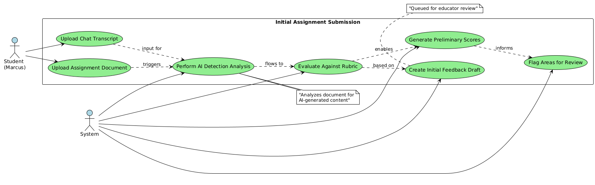
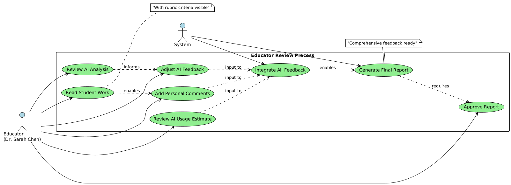
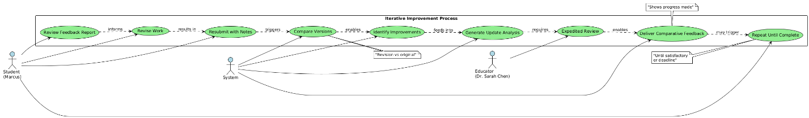
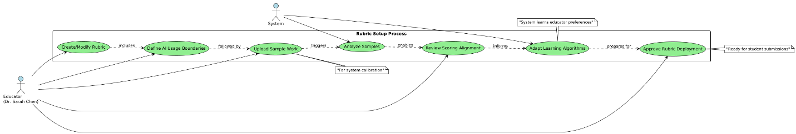
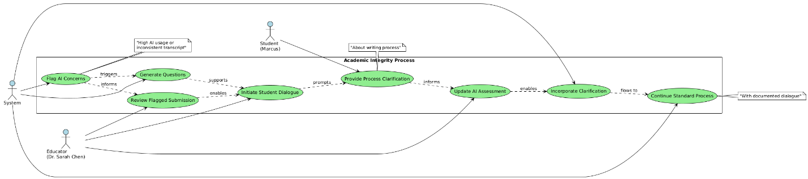

## Summary

This is an **AI-Assisted Academic Integrity and Assessment Platform**
that provides transparent evaluation of student work while supporting
both academic integrity and the evolving reality of AI-assisted
learning. The system analyzes student submissions for AI usage,
evaluates work against custom rubrics, and delivers comprehensive
feedback through a hybrid AI-educator review process.

## Goals

**Primary Goal**: Create a balanced approach to AI usage in education
that promotes learning while maintaining academic standards through
transparent detection, assessment, and iterative improvement.

**Secondary Goals**:

-   Establish clear expectations around AI assistance in academic work

-   Provide detailed, actionable feedback that improves student learning
    outcomes

-   Support educators with efficient, consistent evaluation tools

-   Foster honest dialogue about AI usage rather than punitive
    enforcement

-   Enable iterative improvement through resubmission cycles

## Scope

**In Scope**:

-   AI detection and usage estimation across text-based academic work

-   Customizable rubric-based assessment system

-   Hybrid AI-educator feedback generation

-   Iterative submission and improvement workflow

-   Detailed reporting on both academic quality and AI usage

**Out of Scope**:

-   Plagiarism detection from human sources

-   Real-time writing assistance or tutoring

-   Grade calculation or LMS integration

-   Video/audio submission analysis

-   Institutional policy enforcement

## Personas

**Persona 1: Dr. Sarah Chen - University Educator**

**Role**: Associate Professor of Literature, Community College
**Experience**: 12 years teaching, moderate technology comfort
**Context**: Teaching hybrid courses with 25-35 students per class

**Goals**:

-   Maintain academic standards while adapting to AI-assisted learning

-   Provide meaningful feedback that improves student writing

-   Efficiently evaluate submissions without sacrificing quality

-   Understand how students are using AI tools in their learning process

**Pain Points**:

-   Uncertainty about detecting AI usage in student work

-   Time constraints limiting detailed feedback provision

-   Inconsistency in evaluation when workload is high

-   Lack of clear guidelines for acceptable AI assistance levels

**Usage Patterns**:

-   Reviews 15-20 submissions per week

-   Prefers detailed written feedback over numerical scores

-   Values understanding student learning process over punitive measures

-   Needs quick turnaround for feedback delivery

**Persona 2: Marcus Rodriguez - Undergraduate Student**

**Role**: Junior studying Business Administration **Experience**:
Digital native, comfortable with AI tools **Context**: Taking 15 credit
hours, works part-time, uses AI for various academic tasks

**Goals**:

-   Understand acceptable boundaries for AI assistance

-   Improve writing skills through iterative feedback

-   Receive clear guidance on meeting assignment requirements

-   Learn to use AI tools ethically and effectively

**Pain Points**:

-   Uncertainty about what level of AI assistance is acceptable

-   Fear of academic penalties for honest AI usage

-   Difficulty interpreting rubric requirements

-   Limited time for multiple revision cycles

**Usage Patterns**:

-   Uses AI for brainstorming, outlining, and editing assistance

-   Submits assignments close to deadlines

-   Values specific, actionable feedback over general comments

-   Prefers digital submission and feedback processes

## Use Cases

**Use Case 1: Initial Assignment Submission and Analysis**

**Actors**: Student, System **Preconditions**: Assignment rubric
uploaded by educator, student has completed work

**Flow**:

1.  Student uploads completed assignment document

2.  Student uploads chat transcript of any AI assistance used

3.  System performs AI detection analysis on the document

4.  System evaluates work against rubric criteria

5.  System generates preliminary assessment scores

6.  System flags areas requiring educator review

7.  System creates initial feedback draft based on rubric alignment

**Postconditions**: Assignment queued for educator review with AI
analysis complete

{width="6.490972222222222in" height="2.01875in"}

**Use Case 2: Educator Review and Feedback Integration**

**Actors**: Educator, System **Preconditions**: Student submission
analyzed, preliminary feedback generated

**Flow**:

1.  Educator reviews AI usage analysis and preliminary scores

2.  Educator reads student work with rubric criteria visible

3.  Educator adjusts AI-generated feedback and scores as needed

4.  Educator adds personalized comments and guidance

5.  Educator reviews AI usage estimate and provides context/guidance

6.  System integrates educator feedback with AI analysis

7.  System generates comprehensive feedback report

8.  Educator approves final report for student delivery

**Postconditions**: Complete feedback report ready for student access

{width="6.488888888888889in"
height="2.3555555555555556in"}

**Use Case 3: Iterative Improvement Cycle**

**Actors**: Student, System, Educator **Preconditions**: Student
received initial feedback report

**Flow**:

1.  Student reviews AI usage feedback and rubric scores

2.  Student revises work based on specific feedback points

3.  Student resubmits improved version with revision notes

4.  System compares revision to original submission

5.  System identifies improvements and remaining gaps

6.  System generates updated analysis focusing on changes made

7.  Educator conducts expedited review of revisions

8.  System delivers comparative feedback showing progress

9.  Process repeats until satisfactory completion or deadline

**Postconditions**: Student demonstrates iterative improvement, final
grade assigned

{width="6.483333333333333in" height="0.95in"}

**Use Case 4: Rubric Customization and Calibration**

**Actors**: Educator, System **Preconditions**: Educator has assignment
requirements defined

**Flow**:

1.  Educator creates or modifies evaluation rubric

2.  Educator defines AI usage expectations and boundaries

3.  Educator uploads sample work for system calibration

4.  System analyzes samples against rubric criteria

5.  Educator reviews and adjusts system scoring alignment

6.  System learning algorithms adapt to educator preferences

7.  Educator approves rubric for assignment deployment

**Postconditions**: Customized rubric ready for student submissions with
aligned AI detection parameters

{width="6.5in" height="1.1in"}

**Use Case 5: Academic Integrity Dialogue**

**Actors**: Student, Educator, System **Preconditions**: High AI usage
detected or inconsistent chat transcript

**Flow**:

1.  System flags potential academic integrity concerns

2.  System generates questions about AI usage patterns

3.  Educator reviews flagged submission and system concerns

4.  Educator initiates dialogue with student about AI assistance

5.  Student provides clarification about their writing process

6.  Educator updates AI usage assessment based on dialogue

7.  System incorporates clarification into final evaluation

8.  Process continues with standard feedback delivery

**Postconditions**: Clear understanding established, appropriate
evaluation completed with documented dialogue

{width="6.4944444444444445in"
height="1.4444444444444444in"}

## API Endpoints

  ---------------------------------------------------------------------------------------
  **Endpoint**                     **Method**   **Purpose**                    **Flow
                                                                               Stage**
  -------------------------------- ------------ ------------------------------ ----------
  **RUBRIC SUBMISSION**                                                         

  /api/rubrics                     POST         Submit rubric                  Upload

  /api/rubrics/{id}                GET          Get rubric details             Upload

  **STUDENT SUBMISSION**                                                        

  /api/assignments/{id}/submit     POST         Submit work + chat history     Upload
                                                (triggers auto-pipeline)       

  /api/submissions/{id}            GET          Get submission status/results  Status
                                                                               Check

  **EDUCATOR REVIEW**                                                           

  /api/submissions/pending         GET          Get submissions awaiting       Review
                                                review                         Queue

  /api/submissions/{id}/review     GET          Get full submission data for   Review
                                                review                         

  /api/submissions/{id}/feedback   PUT          Submit educator feedback &     Review
                                                approval                       

  **REPORT DELIVERY**                                                           

  /api/submissions/{id}/report     GET          Get final report (student      Report
                                                view)                          

  **RESUBMISSION**                                                              

  /api/submissions/{id}/revise     POST         Submit revision (triggers      Reupload
                                                re-pipeline)                   

  /api/submissions/{id}/history    GET          Get submission history &       Reupload
                                                comparisons                    

